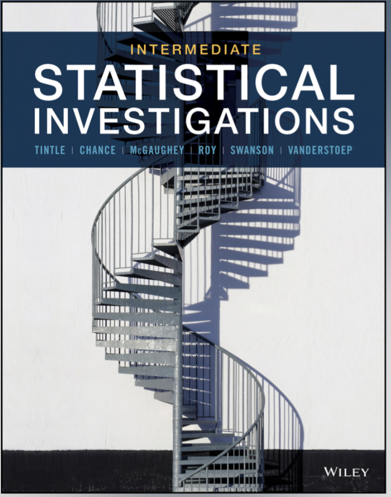
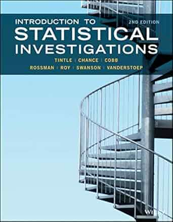

## STAT 331: Statistical Computing in R

::: {.grid}

::: {.g-col-12 .g-col-md-2}

:::

::: {.g-col-12 .g-col-md-10}

[Spring 2026](https://manncz.github.io/stat331-calpoly-s26/), [Spring 2025](https://manncz.github.io/stat-331-s25/), Winter 2024

An introduction to programming for data and statistical analysis in R. The course covers basic programming concepts necessary for statistics, good computing practice, and use of built-in functions to complete basic statistical analyses.

:::

:::

## STAT 301: Statistics I

::: {.grid}

::: {.g-col-12 .g-col-md-2}

:::

::: {.g-col-12 .g-col-md-10}

[Winter 2026](../files/syllabi/stat301-w26.pdf)

An introductory course in statistics for mathematically oriented majors (statistics, mathematics, economics, etc.). The course focuses on the process of statistical investigations including analyzing experiments and observational studies, and conducting inference.

:::

:::

## STAT 313:  Applied Experimental Design and Regression Models

::: {.grid}

::: {.g-col-12 .g-col-md-2}

:::

::: {.g-col-12 .g-col-md-10}

[Fall 2025](../files/syllabi/stat313-f25.pdf)

A second statistics course for students not majoring in statistics or mathematics. The primary focus of the course is explaining variation in continuous outcomes using ANOVA and regression analysis. A variety of experimental designs are explored.

:::

:::

## STAT 217: Introduction to Statistical Concepts and Methods

::: {.grid}

::: {.g-col-12 .g-col-md-2}

:::

::: {.g-col-12 .g-col-md-10}

[Fall 2024](../files/syllabi/stat217-f24.pdf)

An introductory course in statistics for liberal arts majors. The course addresses issues in data collection, including sampling and experimental design, graphical and numerical techniques for exploring and modeling data, and statistical inference.

:::

:::

